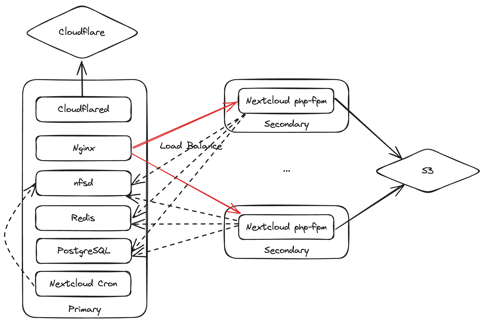

## Architecture



## Usage

### AIO Mode

1. Create link for the compose file by running `ln -s compose.aio.yml compose.yml`
2. Run `docker compose up -d` to start
3. If clean up is needed for testing, run `docker compose down -v` to remove all volumes created

### Cluster Mode

#### Primary Node

1. Create link for the compose file by running `ln -s compose.primary.yml compose.yml`
2. Edit `.env` to specify the network subnet of the cluster
3. Run `docker compose up -d` to start

#### Secondary Node

1. Create link for the compose file by running `ln -s compose.secondary.yml compose.yml`
2. Edit `.env` to specify the IP address of the primary node
3. Edit `.env` to specify the Nextcloud trusted proxy network subnet
4. Run `docker compose up -d` to start

## Helpers

`instance_init.sh` : Setup new AWS EC2 instance for Nextcloud on Docker
`migrate_volume.sh` : Helper script for migrating existing Docker Volume to another machine / volume

## Environment Variables

### .env

```env
NEXTCLOUD_TRUSTED_DOMAINS=
NEXTCLOUD_TRUSTED_PROXIES=
CLUSTER_HOST_SUBNET=
CLUSTER_PRIMARY_HOST=
```

### s3.env

```env
OBJECTSTORE_S3_BUCKET=
OBJECTSTORE_S3_REGION=
OBJECTSTORE_S3_HOST=
OBJECTSTORE_S3_USEPATH_STYLE=
OBJECTSTORE_S3_KEY=
OBJECTSTORE_S3_SECRET=
OBJECTSTORE_S3_SSL=
```

### smtp.env

```env
ST_TELEGRAM_CHAT_IDS=
ST_TELEGRAM_BOT_TOKEN=
```

### db.env

```env
POSTGRES_PASSWORD=
POSTGRES_DB=
POSTGRES_USER=
```

### cloudflared.env

```env
TUNNEL_TOKEN=
```